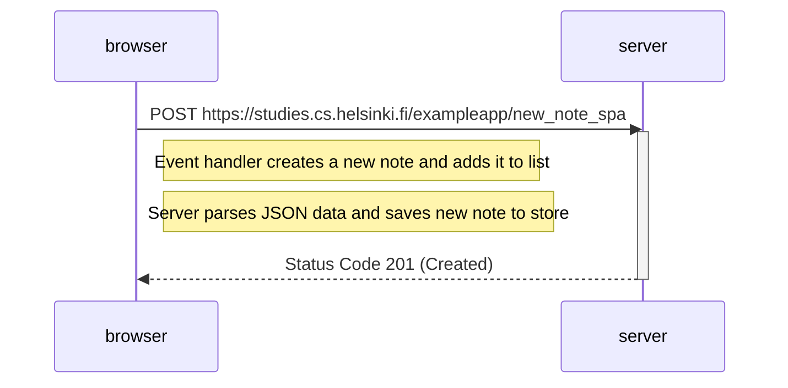

```mermaid
sequenceDiagram;
    participant browser
    participant server

    browser->>server: POST https://studies.cs.helsinki.fi/exampleapp/new_note_spa
    activate server

        Note right of browser: Event handler creates a new note and adds it to list
        Note right of browser: Server parses JSON data and saves new note to store

    server-->>browser: Status Code 201 (Created)
    deactivate server
```
